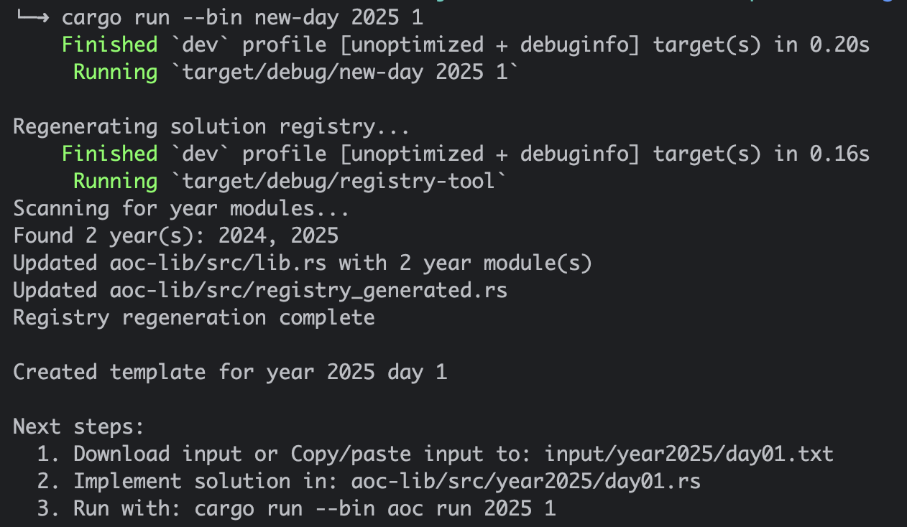

# Advent of Code - Rust Template

[](https://github.com/sanctusgee/advent-of-code-rust-template/generate)
[](https://www.rust-lang.org/)
[](https://opensource.org/licenses/MIT)


A Rust workspace for Advent of Code that stays sane across **all days** and **multiple years**.

- One workspace for every year (2015–20xx).
- Automatic registry: no more manual `lib.rs` edits when you add years/days.
- Simple CLI for scaffolding, running, listing, and downloading puzzles.
- Self-healing registry if you move/delete files.

Focus on solving puzzles, not babysitting modules.

---

## Quick Start

Clone and build:

```bash
git clone https://github.com/sanctusgee/advent-of-code-rust-template.git
cd advent-of-code-rust-template
cargo build


## Quick Start

```bash
# Clone and build
git clone https://github.com/sanctusgee/advent-of-code-rust-template.git
cd advent-of-code
cargo build
````

After the initial build, you can now start generating new years and days.

# Create a new day (automatically updates registry)
```
cargo run --bin new-day 2025 1 // this creates the year and 1st day module
```



This will:

- Create `aoc-lib/src/year2025/day01.rs` with a solution template.

- Update `aoc-lib/src/year2025/mod.rs` with the new day.

- Add `pub mod year2025`; to `aoc-lib/src/lib.rs` (if it’s a new year).

- Regenerate `aoc-lib/src/registry_generated.rs` with routing logic for existing years/days.

- Create a blank `input/year2025/day01.txt` file as a placeholder.


### Subequent days can be created with:

```bash
cargo run --bin new-day 2025 2 // creates day 2 module for 2025
cargo run --bin new-day 2025 3 // creates day 3 module for 2025
...
```

### Download input (requires AOC_SESSION env var)

To download inputs, you need your AoC session cookie:

- Log in to [adventofcode.com](https://adventofcode.com)
- Open DevTools (varies by browser, usually right-click + Inspect or Inspect Element)
- Select the `Network` tab
- Refresh the page - you should now see network requests appearing.
- Click any request whose `Domain` is `adventofcode.com`.
- In the request details, find the `Headers` section.
- Look for the `Cookies` tab on the right side.
- Copy the long hex part that starts with `session=` 
- Next, export the session cookie as an environment variable with the command:
        
    `export AOC_SESSION="paste_the_value_here"`

Example: 
    `export AOC_SESSION="3451b2c3d4e5f1234abcd554321abc123def"`

Don't commit this value.

#### Download input for a specific day:
`cargo run --bin aoc download 2025 1`

### Running Solutions  
Solve the puzzle in your day file, then:
`cargo run --bin aoc run 2025 1`

```
# Run a single solution
cargo run --bin aoc run 2025 1

# List all registered solutions
cargo run --bin aoc list
```

---

## How It Works

Solutions live in `aoc-lib/src/yearYYYY/dayDD.rs`. 
The registry system wires this up so commands like: `cargo run --bin aoc run 2025 1` to the correct solver function.

All years sit in the same codebase as separate modules. You can bounce between:

- year2015 retro puzzles,

- your current year2025,

- or future year2026

without creating new crates or workspaces.

Rust’s incremental compilation means only the files you change are recompiled, so multiple years stay manageable.

Shared utilities (parsers, grid helpers, regex helpers, etc.) live in aoc-lib/src/utils/ and can be reused across all years.

---

### Automatic Registry Management

When you run `cargo run --bin new-day 2025 1`, it:
1. Creates `aoc-lib/src/year2025/day01.rs` with a solution template
2. Updates `aoc-lib/src/year2025/mod.rs` to register the new day
3. Adds `pub mod year2025;` to `aoc-lib/src/lib.rs` (if it's a new year)
4. Regenerates `aoc-lib/src/registry_generated.rs` with routing logic
5. Creates `input/year2025/day01.txt` placeholder

No manual editing required. The registry stays in sync with your file structure.

## Workspace Layout

```
├── aoc-lib/
│   └── src/
│       ├── lib.rs                    # Module declarations (auto-managed)
│       ├── registry_generated.rs     # Routing logic (auto-generated)
│       ├── year2024/
│       │   ├── mod.rs                # Day registrations
│       │   ├── day01.rs              # Your solutions
│       │   └── day02.rs
│       └── utils/                    # Input/output helpers
├── aoc/
│   └── src/
│       ├── main.rs                   # CLI: run, list, download
│       └── bin/
│           └── new-day.rs            # Scaffolding tool
├── registry-tool/                    # Independent registry manager
│   └── src/main.rs
├── input/
│   └── year2024/
│       ├── day01.txt                 # Puzzle inputs (gitignored)
│       └── day02.txt
└── benches/                          # Criterion benchmarks
```

### Self-Healing Registry

The `registry-tool` binary scans the file tree and rebuilds the registry from scratch. It has no dependency on `aoc-lib`, so it will run even when the main crate doesn’t compile.

Use it when:
- You manually delete a year directory.
- You manually move or rename files and things no longer line up.

`cargo run --bin registry-tool`

This fixes `lib.rs` and `registry_generated.rs` to match what actually exists on disk.


## Generated Solution Template

Each day is scaffolded with this structure:

```rust
use crate::utils;
use anyhow::Result;

pub fn solve() -> Result<()> {
    let input = utils::load_input(2025, 1)?;
    
    let part1 = solve_part1(&input)?;
    let part2 = solve_part2(&input)?;
    
    println!("Day 1 / Year 2025");
    println!("Part 1: {}", part1);
    println!("Part 2: {}", part2);
    
    Ok(())
}

fn solve_part1(_input: &str) -> Result<impl std::fmt::Display> {
    // Replace with your solution
    Ok(0)
}

fn solve_part2(_input: &str) -> Result<impl std::fmt::Display> {
    // Replace with your solution
    Ok(0)  
}
```

## Commands reference

```bash
# Create a new day
cargo run --bin new-day <year> <day>

# Run a solution
cargo run --bin aoc run <year> <day>

# List all solutions
cargo run --bin aoc list

# Download puzzle input (requires AOC_SESSION env var)
cargo run --bin aoc download <year> <day>

# Fix registry after manual file changes
cargo run --bin registry-tool
```


Input loading, error handling, and output formatting are already wired up. Just implement the two solver functions.

## Testing & Benchmarking

```bash
cargo test
cargo bench
```

Benchmark reports go to `target/criterion/report/index.html`.

## Dependencies

Core: `anyhow`, `clap`, `colored`, `reqwest`, `criterion`

Optional (commented out in `Cargo.toml`): `regex`, `itertools`, `ahash`, `atoi`, `once_cell`

## Troubleshooting
Ideally, you never have to manually edit any files. But if you do, here are common errors and how to fix them.
### "file not found for module" - Year folder deleted

**Error:**
```
error[E0583]: file not found for module `year2015`
 --> aoc-lib/src/lib.rs:8:1
```

**Cause:** You deleted `aoc-lib/src/year2015/` but `lib.rs` still references it.

**Fix:**
```bash
cargo run --bin registry-tool
```

---

### "file not found for module" - Day file deleted

**Error:**
```
error[E0583]: file not found for module `day02`
 --> aoc-lib/src/year2024/mod.rs:7:1
```

**Cause:** You deleted `aoc-lib/src/year2024/day02.rs` but `year2024/mod.rs` still references it.

**Fix Option 1 - Recreate the day:**
```bash
cargo run --bin new-day 2024 2
```

**Fix Option 2 - Remove permanently:**

Edit `aoc-lib/src/year2024/mod.rs`:
1. Remove: `mod day02;`
2. Remove: `("2", day02::solve),`

**Note:** `registry-tool` manages years, not individual days.

Yes, we could extend it to handle days too, or even implement a `remove-day` command, but then this template would be more complex. 

---

### "No solution found for year X day Y"

**Error:**
```
Error: No solution found for year 2024 day 5

To create this day: cargo run --bin new-day 2024 5
If the day exists: cargo run --bin registry-tool
```

**Fix - Create the solution:**
```bash
cargo run --bin new-day 2024 5
```

**Fix - Registry out of sync:**
```bash
cargo run --bin registry-tool
```

---

### Year validation errors

**Error:**
```
Error: Year must be between 2015 and 2099 (Advent of Code years)
```

**Fix:** Use a 4-digit year between 2015 and 2099:
```bash
cargo run --bin aoc run 2024 1   # Correct
cargo run --bin aoc run 35 1     # Wrong
cargo run --bin aoc run 2125 1   # Wrong
```

---

### Day validation errors

**Error:**
```
Error: Day must be between 1 and 25
```

**Fix:** Use a day between 1 and 25:
```bash
cargo run --bin aoc run 2024 1   # Correct
cargo run --bin aoc run 2024 0   # Wrong
cargo run --bin aoc run 2024 26  # Wrong
```

Yes, this is intentional: hardcoded to 25 days to allow compatibility with previous AoC years.

---

### Input file missing

**Error:**
```
Error: Failed to load input file
```

**Fix - Download from Advent of Code:**
```bash
export AOC_SESSION="your_session_cookie"
cargo run --bin aoc download 2024 1
```

**Fix - Create manually:**
Create `input/year2024/day01.txt` and paste your puzzle input.
___
## Code Quality

The workspace passes `cargo clippy --all-targets --all-features` without warnings to ensure a clean baseline.

---

## License

MIT
