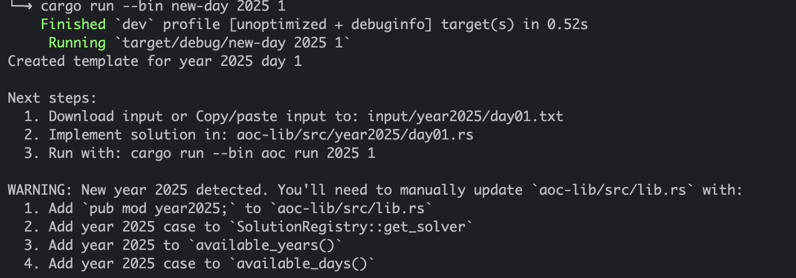

# Advent of Code Template (Rust)

[](https://github.com/sanctusgee/advent-of-code-rust-template/generate)
[](https://www.rust-lang.org/)
[](https://opensource.org/licenses/MIT)

This repository provides a structured [Rust workspace](https://doc.rust-lang.org/cargo/reference/workspaces.html) for solving Advent of Code puzzles.  
The layout is designed to stay manageable across all AoC days while keeping the code easy to navigate and extend.

---

## Workspace Structure

```
. 
└── aoc-lib/
│    └── src/
│        ├── lib.rs                # Year/day registry
│        ├── year2024/
│        │   └── day01.rs          # Example solution
│        │   └── mod.rs            # Generated when you create new days. Step 1 below
│        ├── year20XX/
│        │   └── day01.rs          # Generated when you create new days. Step 1 below
│        │   └── mod.rs            # Generated when you create new days. Step 1 below
│        └── utils/
│            ├── mod.rs
│            ├── input.rs          # Local + remote input loading
│            └── output.rs         # Formatting helpers
└── aoc/
│    └── src/
│        ├── main.rs               # Run/list/download commands
│        └── bin/
│            └── new-day.rs        # Generates year/day modules
└── benches/
│    └── all_days.rs               # Criterion benchmarks
│    input/
│    └── year2024/                 # Generated input folder. Step 4 below
│        └── day01.txt             # Downloaded input file. Step 4 below
│        └── ...                   # Additional input files per day
└── rustfmt.toml
```


---

## Prerequisites

- A Rust toolchain (`rustup` recommended)  
- An Advent of Code account  
- Your personal AoC session cookie (`session=...`)  

---

## Setup

    git clone https://github.com/sanctusgee/advent-of-code-rust-template
    cd advent-of-code-rust-template
    cargo build

After the initial build, you can now start generating new years and days.

---


### 1. First time: create Year module + Day 1 module

**Always** start by creating Day 1 for a new year. For example, year 2025 day 1

    cargo run --bin new-day 2025 1

This script:

- creates `aoc-lib/src/year2025.rs` if it doesn’t exist  
- creates `aoc-lib/src/year2025/day01.rs`  
- creates `input/year2025/day01/`  
- prints the exact instructions of what to add to `aoc-lib/src/lib.rs`  




---

### 2. Update `lib.rs` 
 This is a manual **one-time setup step per year**. Will be automated in a future release.

### 3. Create Additional Days (as needed)

    cargo run --bin new-day 2025 2 // change the day value as needed

Use the same command pattern for each new day.

---

### 4. Download Inputs from AoC

    cargo run --bin aoc download 2025 1 // change the day value as needed

Inputs are stored under:

    input/<yearYYYY>/<dayXX>.txt  

_where: YYYY is the four-digit year and 
        XX represents the zero-padded day number, eg 01, 02, ..., N_

The input files are ignored by Git by default so you won’t commit personal data.

---

**How to get your AoC session cookie (Required for input downloads)**
        
- Go to https://adventofcode.com and make sure you are logged in.

- Open your browser’s Developer Tools (usually right-click --> Inspect / Inspect Element).
- In Developer Tools, select the Network tab.
- Refresh the page - you should now see network requests appearing.
- Click any request whose domain is adventofcode.com.
- In the request details, find the Headers section.
- Look for the cookie header.
- Copy the part that starts with `session=` 
- Next, export the session cookie as an environment variable with the command:
        
    `export AOC_SESSION="paste_the_value_here"`

Example: 
    `export AOC_SESSION="3451b2c3d4e5f1234abcd554321abc123def"`

Keep this value private and **do not** commit it.
        

### 5. Run a Solution

    cargo run --bin aoc run 2025 1 // change the day value as needed

### (Optional):  List available solvers:

    cargo run --bin aoc list

---

## Generated Day Scaffold

Each new day includes the same starter structure so you can focus directly on the puzzle:

    use crate::utils;
    use anyhow::Result;

    pub fn solve() -> Result<()> {
     let input = utils::load_input(2025, 1)?;
     
     let part1 = solve_part1(&input)?;
     let part2 = solve_part2(&input)?;
     
     println!("Day 1 / Year 2025");
     println!("Part 1: {}", part1);
     println!("Part 2: {}", part2);
     
     Ok(())
    }

    fn solve_part1(input: &str) -> Result<impl std::fmt::Display> {
     Ok(0)
    }

    fn solve_part2(input: &str) -> Result<impl std::fmt::Display> {
     Ok(0)
    }

You can change this file as needed. The only required convention is that each day exposes a `solve()` function returning `anyhow::Result<()>`.

---

## Testing

    cargo test day02

You can place tests directly alongside each day’s solution module.

---

## Benchmarking (Optional)

    cargo bench

Criterion will generate a report under:

    target/criterion/report/index.html

Benchmarking can help when experimenting with different solution approaches.

---

## Dependencies

Core libraries:

- `anyhow`
- `clap`
- `colored`
- `reqwest`
- `criterion`

Optional utilities (commented out by default):

- `regex`
- `itertools`
- `ahash`
- `atoi`
- `once_cell`

The workspace passes:

    cargo clippy --all-targets --all-features

without warnings to ensure a clean baseline.

---

## License

MIT
